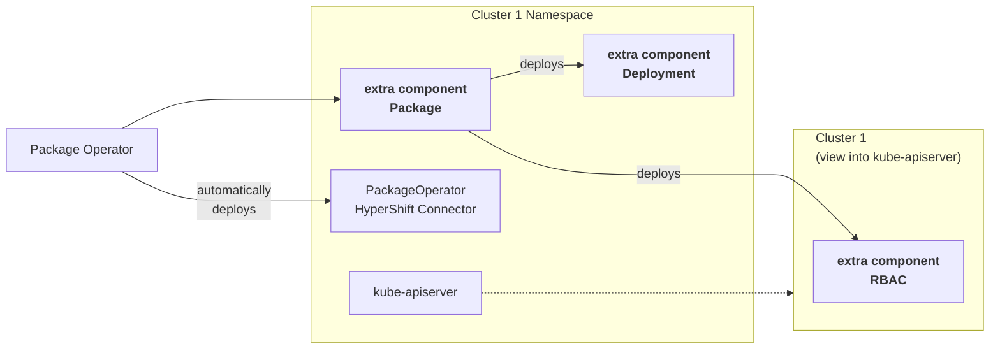

[HyperShift](https://hypershift-docs.netlify.app/) is middleware for hosting [OpenShift](https://www.openshift.com/) control planes at scale.  
In a nutshell, HyperShift uses a central Kubernetes cluster to host the control plane components of multiple "guest" Kubernetes clusters.

HyperShift architecture refers to these clusters as "*Management Cluster*" and "*Hosted Cluster*".

This topology gives users a new place to install applications and cluster operators. These cluster extensions don't have to run on the Hosted Cluster, but can instead be pulled into the Management Cluster.

Hosting components on the control-plane side has several advantages:
- Access isolation to the Deployment from the Hosted Cluster
- Hosted Cluster can be scaled to zero workers without impact to the control plane
- Separated failure domain
- Reduced resource consumption

In a lot of cases it also introduces a new challenge:  
*How can I coordinate the deployment in the Management and the Hosted Cluster?*

Thats where Package Operators HyperShift integration comes into play.

**HyperShift Management Cluster**


When deployed to a HyperShift Management Cluster, Package Operator will automatically deploy a connector piece into every HyperShift Hosted Cluster Namespace, next to other control-plane components.

With this component in place, `Packages` and `ObjectDeployments` can choose to route objects to the Hosted Clusters kube-apiserver, by setting the `class` property of a phase to `hosted-cluster`.

Phases with and without the class property can be freely combined to coordinate rollout across the two clusters.
e.g.:
1. create a Namespace and RBAC on the Hosted Cluster
2. deploy an Operator on the Management Cluster
3. create configuration objects in the Hosted Cluster

Example YAML:
```yaml
apiVersion: package-operator.run/v1alpha1
kind: ObjectDeployment
spec:
  template:
    spec:
      phases:
      - name: rbac-and-stuff
        class: hosted-cluster
        objects: []
      - name: deploy
        objects: []
      - name: configure
        class: hosted-cluster
        objects: []
```
