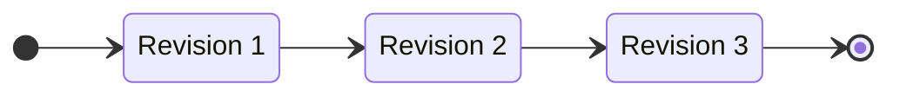
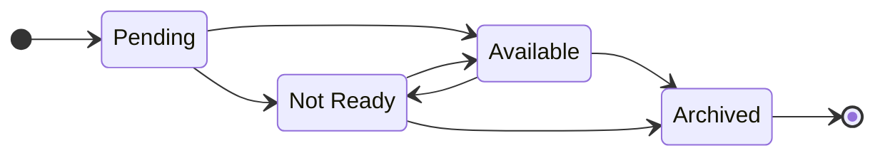
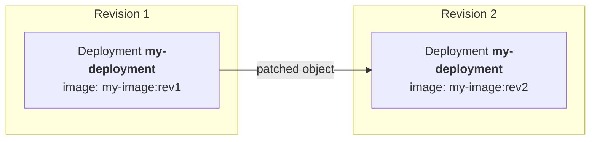
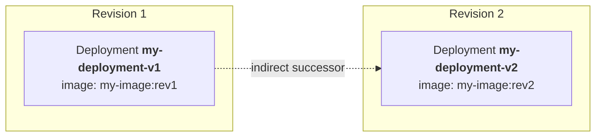
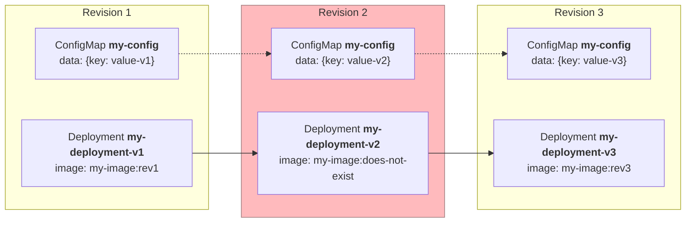
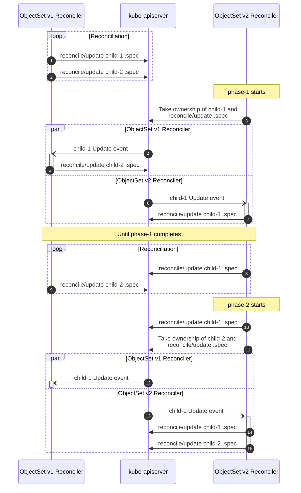

Revisions are iterations and changes of a deployment over time. To support zero-downtime
deployments, even if something goes wrong, Package Operator can manage multiple
active revisions at the same time. This strategy is also often referred to as
"A/B deployment" or "canary deployment".

A revision is represented by the `ObjectSet`/`ClusterObjectSet` APIs.

While revision are ordered on a time axis, Package Operator makes no assumptions
on the contents of each revisions. This means that Revision 3 could contain the
same spec as Revision 1, rolling back changes introduced by Revision 2.

## Revision Lifecycle



- **Pending**\
  Intermediate state before the controller posted its first update.
- **Available**\
  All availability probes are successful.
- **Not Ready**\
  One or more availability probes are unsuccessful.
- **Archived**\
  (Cluster)ObjectSet is shutdown and only acts as a revision tombstone for rollbacks.

In addition to these major lifecycle states, (Cluster)ObjectSets may be **Paused**,
stopping reconciliation, while still reporting status.
This can be useful for testing and debugging.

## Rollout Handling

Depending on the contents of the new revision, objects are eventually either:

- **Patched**\
  If the object still part of the new revision, it will be handed over to the next
  revision.
- **Deleted**\
  If the object is not part of the new revision, it will be deleted when the old
  revision is archived.

### In-Place Updates



"In-Place" updates happen when a new revision contains an object with the same name
and type as the previous revision. Objects are handed over to a new revision and
patched as needed.

When all objects have been handed over to a new revision, the previous revision
is automatically **archived**.



### A/B Updates



A/B updates happen when a new revision does not contain an object with the same
name and type as a previous revision. A new object is created in the new revision
without affecting the old object.

The old revision is only archived when the new revision has completely finished
its rollout and is "Available".

### Intermediate (Failed) Revisions



Under normal circumstances at max 2 Revisions can be active during rollout. An old
and a new revision.

If a revision fails to become available due to e.g. misconfiguration and a new revision
supersedes it, multiple intermediate revisions might be active until the latest
revision becomes available.

Intermediate revisions will only be cleaned up if:

- Latest revision becomes available
- Revision is not reconciling any objects anymore
- Latest revision is not containing any object still actively reconciled by an intermediate



In the example above, the ConfigMap "my-config" is handed over from revision 1 to
revision 2 and in the end to revision 3.

As soon as revision 3 takes ownership of the ConfigMap, the failed intermediate
revision 2 can be archived, as "my-deployment-v2" no longer exists in revision 3
and is thus safe to delete.

## Internals

### ObjectSet to ObjectSet Handover

```yaml
apiVersion: package-operator.run/v1alpha1
kind: ObjectSet
metadata:
  name: v1
spec:
  phases:
  - name: phase-1
    objects: [{name: child-1}]
  - name: phase-2
    objects: [{name: child-2}]
---
apiVersion: package-operator.run/v1alpha1
kind: ObjectSet
metadata:
  name: v2
spec:
  phases:
  - name: phase-1
    objects: [{name: child-1}]
  - name: phase-2
    objects: [{name: child-2}]
  previous:
  - name: v1
    kind: ObjectSet
    group: package-operator.run
```


