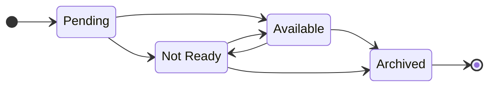
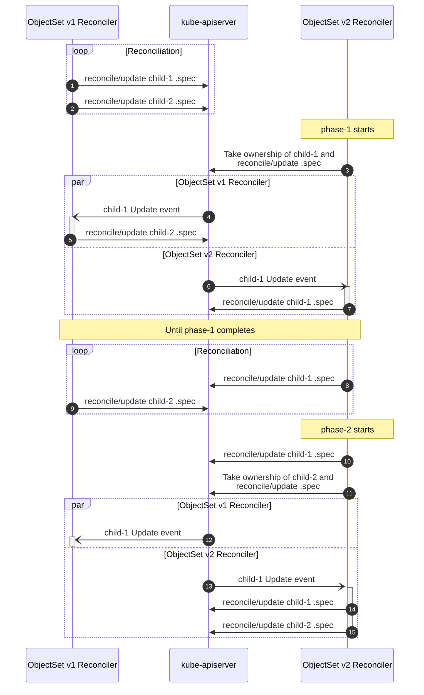

## (Cluster)ObjectSet Lifecycle



- **Pending**  
  Intermediate state before the controller posted it's first update.
- **Available**  
  All availability probes are successful.
- **Not Ready**  
  One or more availability probes are unsuccessful.
- **Archived**  
  (Cluster)ObjectSet is shutdown and only acts as a revision tombstone for rollbacks.

Additionally to these major lifecycle states, (Cluster)ObjectSets may be **Paused**, stopping reconciliation, while still reporting status.
This can be useful for testing and debugging.

## ObjectSet to ObjectSet

```yaml
apiVersion: package-operator.run/v1alpha1
kind: ObjectSet
metadata:
  name: v1
spec:
  phases:
  - name: phase-1
    objects: [{name: child-1}]
  - name: phase-2
    objects: [{name: child-2}]
---
apiVersion: package-operator.run/v1alpha1
kind: ObjectSet
metadata:
  name: v2
spec:
  phases:
  - name: phase-1
    objects: [{name: child-1}]
  - name: phase-2
    objects: [{name: child-2}]
  previous:
  - name: v1
    kind: ObjectSet
    group: package-operator.run
```


